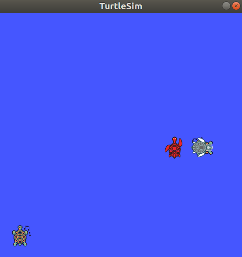
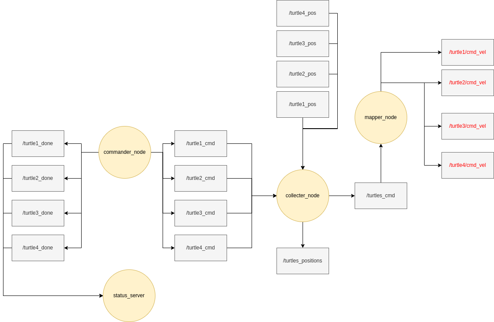

# Homework1

This homework covers ROS publisher, subscriber, service, client, custom messages, and custome services. The intention is to help you to get practical experience with ROS and have some good understanding with coding. 

This homework can be done in teams such that the maximum is **2** members.

You can ask us any questions any time, in the group or directly to us.

## Deadline

**12.06.2022, 11:59pm**

## Description

You have 4 turtles in turtlesim, each turtle should move according to specific commands. The turtles are drawing some shapes. 

There is a commander_node (main node) (Implemented by me in package called homework1) that sends a set of commands.

commander_node publishes 8 topics:
* /turtle\<i>_cmd with type geometry_msgs/Twist
* /turtle\<i>_done with type std_msgs/Bool

such that i is the number of the turtles from 1 to 4.

Assume, you do not have the access to the implementation of the commander_node, you only observes the topics that it publishes to, nothing more. That is why you need to use these topics directly. Furthermore, in real life, we may need to process the data in the topics that the commander sends, then sends it back to the correct topics and we are trying to simulate such a situation.

Your task is to do the following:

* Download and build this ROS package in your workspace (It is called homework1)

* Create a ROS package with your name(s)
    
    Package name should be as following: homework1_firstname_lastname, for example: homework1_hany_hamed

    In case of teams, you put the first name of the second person instead of the last name.

    This package is what you will submit!

    Hint: do not forget the dependencies!

* Add the name of the team members (first and last names) in Maintainers in package.xml

* Create a server called start_server that has two services /start and /stop that sends to a topic /start_topic with type std_msgs/Bool that if /start service is called from the command line, it will publish to /start_topic True, and if /stop service is called, it will publish False. This topic is subscribed by the commander_node.

* Create a node called turtles_spawner
    * Kill the initial turtle ([turtlesim/Kill service](http://docs.ros.org/en/api/turtlesim/html/srv/Kill.html))
    * Spawn four turtles with the following parameters
        - x=1, y=1, theta=M_PI/2.0, name="turtle1"
        - x=8, y=5, theta=M_PI/2.0, name="turtle2"
        - x=9.25, y=5, theta=M_PI, name="turtle3"
        - x=9.25, y=5, theta=0, name="turtle4"
        - [Source: turtlesim/Spawn service](http://docs.ros.org/en/api/turtlesim/html/srv/Spawn.html)
    * Then this node terminates

    The starting positions should be as folowing (Of course, not the same turtles colours)
    

* Create a custom message called TwistArray that contains four geometry_msgs/Twist, one for each turtle. ([source](http://docs.ros.org/en/api/geometry_msgs/html/msg/Twist.html))

* Create a node called collecter_node that subscribes to the topics that commander_node publishes to. 
    * It collects the data from /turtle\<i>_cmd topics and publishes it to a topic with type TwistArray (You created this message) (The topic name is turtles_cmd)

    * It subscribes to /turtle\<i>/pose topics from turtlesim and collects them to a topic called turtles_positions with type geometry_msgs/PoseArray ([Source](http://docs.ros.org/en/api/geometry_msgs/html/msg/PoseArray.html)).
        * Note: [geometry_msgs/PoseArray](http://docs.ros.org/en/lunar/api/geometry_msgs/html/msg/PoseArray.html) contains an array of [geometry_msgs/Pose](http://docs.ros.org/en/lunar/api/geometry_msgs/html/msg/Pose.html) and  [std_msgs/header](http://docs.ros.org/en/lunar/api/std_msgs/html/msg/Header.html). You may not use the header data.
        * /turtle\<i>/pose topics has a message with type: [turtlesim/Pose](http://docs.ros.org/en/api/turtlesim/html/msg/Pose.html), however, it is not the same as geometry_msgs/Pose. Thus, you either use geometry_msgs/PoseArray and map between the data fields (they are not the same), for example, turtlesim/Pose has linear_velocity and angular_velocity but geometry_msgs/Pose does not have them, you may put these values in the Quaternion part of the message and so on. Or create a new custom message that has 4 fields (or array) of turtlesim/Pose messages and use it, and this doing this is better.

* Create a node called mapper_node that subscribe to the topic (/turtles_cmd) from the collector_node and publishes it to the correct turtles velocity commands topics 

* Create a service that's called status that when it is requested with an std_srvs/Empty request ([Source](http://docs.ros.org/en/api/std_srvs/html/srv/Empty.html)), it just responds with an Empty response as well but prints to the command line the status of the turtles using ROS_INFO. It gets the information of the turtles status from /turtle\<i>_done topics

* Do not forget to change CMakeLists.txt and package.xml

* Create run.launch file to launch all the nodes including the commander_node.

* Note that you need to call start service to make everything starts

### Bonus points

The following points can be awarded after finishing all the previous steps. Then you can make another package with the bonus parts.

* Change the necessary codes including the commander_node to make them draw the shape using only 3 turtles (1 point)
* Change and optimize the architechture and make it better, and justify why!
* Combine the start_server with the commander_node (Change the commander_node)
* Create the nodes in OOP style!
* If you can directly remap topics from the commander_node to the turtles through the launch file!
* Find bugs in the assignment description, assignment supported materials (image, given package, ...etc)
* Improve the homework task for making it more challenging!
* Add README.md with commands and documentation on how to run these nodes, pakcages, launch files.

### System architecture

## Submission

You shoud take a screenshot of the result of the turtlesim after the turtles draws everything and submit it inside a folder inside the package called media. Furthermore, you can add a README.md if you like for documentation or notes.

You should submit a zip file that includes only your ROS package to Moodle. For teams, you can submit a single package!

## Grading

* This homework costs 15 points
* There are multiple extra bonus points
* The deadline is flexible which means that if you are late by minutes or couple of hours (i.e, till 3 hours it is ok).
* Late submission is allowed in case of problems out of control (health including physical or mental problems). So, do not worry, your health should be your number 1 priority!
* Do not worry if you had some problems, you can ask us anytime, ask your friends, it is not bad to ask for help!
* Please do not put a lot of time in the assignment (maybe 2~3 hours per day), enjoy your time, do not feel stressed and do not wake all the night solving the assignment, please!
